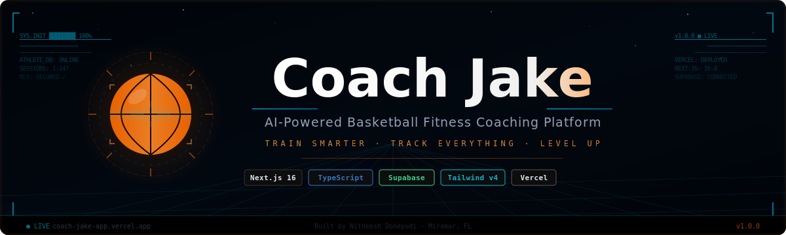

<div align="center">



<br/>

[](https://nextjs.org/)
[](https://www.typescriptlang.org/)
[](https://tailwindcss.com/)
[](https://supabase.com/)
[](https://vercel.com/)

[](https://coach-jake-app.vercel.app)
[](LICENSE)
[](CONTRIBUTING.md)

[🚀 Live Demo](https://coach-jake-app.vercel.app) &nbsp;·&nbsp; [🐛 Report Bug](https://github.com/Nitheesh0217/coach-jake-app/issues) &nbsp;·&nbsp; [✨ Request Feature](https://github.com/Nitheesh0217/coach-jake-app/issues)

</div>

---

## Overview

**Coach Jake** (codenamed _Levrl_) is a full-stack basketball fitness coaching SaaS platform built to connect athletes and coaches in one intelligent workspace.

Athletes complete a personalized onboarding wizard that builds their **Player Card** — capturing archetype, playstyle, goals, and schedule — then get a daily workout, session streak tracking, and body measurement logging. Coaches get a full roster dashboard with per-athlete completion analytics and workout assignment tooling.

Built end-to-end as a solo project: schema design → server actions → deployed UI.

---

## Screenshots

### Landing Page


<br/>

### Auth — Sign Up & Login

<table>
<tr>
<td width="50%"></td>
<td width="50%"></td>
</tr>
<tr>
<td align="center"><sub>Sign Up</sub></td>
<td align="center"><sub>Login</sub></td>
</tr>
</table>

<br/>

### Onboarding — Player Card Wizard

<table>
<tr>
<td width="50%"></td>
<td width="50%"></td>
</tr>
<tr>
<td align="center"><sub>Step 1 — Profile & Archetype</sub></td>
<td align="center"><sub>Step 2 — Playstyle Sliders</sub></td>
</tr>
</table>

<br/>

### Dashboards

<table>
<tr>
<td width="50%"></td>
<td width="50%"></td>
</tr>
<tr>
<td align="center"><sub>Athlete Dashboard</sub></td>
<td align="center"><sub>Coach Dashboard — Roster View</sub></td>
</tr>
</table>

<br/>

### Workouts & Session Logging

<table>
<tr>
<td width="50%"></td>
<td width="50%"></td>
</tr>
<tr>
<td align="center"><sub>Workout Feed</sub></td>
<td align="center"><sub>Session Log</sub></td>
</tr>
</table>

---

## Latest Updates (Build Verified)

### Core Loop Improvements ✨

- **Smart Drill Parsing** — Workout descriptions are now parsed into interactive drill checklists. No more hardcoded drills.
- **Completed-Today Status** — Workouts show three states: "Completed Today ✓", "Done Before", or "Log This Workout"
- **All-Time Leaderboard** — Finally backed by data! Leaderboard's "All Time" tab now queries actual session history
- **Real Archetype Display** — Leaderboard position badges show athlete's actual archetype instead of hardcoded labels
- **Pagination Ready** — Workouts limited to 200 records, leaderboard to 100, for production scalability
- **Error Boundaries** — Graceful error states on `/workouts` and `/leaderboard` with retry buttons
- **Fixed Loading Skeletons** — Dashboard loading state now matches final 2x2 KPI card layout

### Build Status

✅ **Production build passing**  
✅ **All TypeScript errors resolved**  
✅ **No hardcoded demo data remaining**  
✅ **All imports and queries validated**

---

## Features

#### Athlete

- **Player Card Wizard** — 4-step onboarding captures archetype, playstyle sliders (team/iso, shooter/slasher, finesse/power), goals, and weekly schedule
- **Daily Workout** — today's assigned workout surfaced automatically on the dashboard with drill checklist
- **Workout Logging** — Mark Complete button with loading states and error handling
- **Streak Tracking** — 7-day and 30-day session counters with trend indicators
- **Body Measurements** — date-stamped weight history with progress charts
- **Player Card Profile** — public scouting card with tagline, Instagram & YouTube links
- **Workouts Browse** — full library with filters (All, Assigned, Completed); shows "Completed Today" vs "Completed Before" status
- **Leaderboard** — real-time ranking by sessions completed (This Week, This Month, All Time)
- **Progress Tracking** — weight trends and weekly consistency charts

#### Coach

- **Athlete Roster** — full list with completion %, sessions this week, last workout date
- **Workout Assignment** — assign workouts to individual athletes with optional notes
- **Trainer Dashboard** — dedicated analytics view, isolated from athlete routing
- **Athlete Performance Insights** — KPIs, consistency tracking, measurement history

#### Platform

- Role-based auth with Supabase — `athlete` and `coach` routing enforced at middleware
- Row Level Security on every table — all queries scoped to `auth.uid()`
- Server Components + Server Actions throughout — no client-side data fetching
- Leaderboard ranked by total session count — with date-filtered weekly/monthly views and all-time rankings
- Smart drill parsing — workout descriptions auto-converted to drill checklists
- Completed-today status — accurate workout completion state per date
- Error boundaries — graceful error handling on all major pages
- Pagination support — workouts (200 limit), leaderboard (100 limit)

---

## Tech Stack

| Layer      | Choice              | Notes                                    |
| ---------- | ------------------- | ---------------------------------------- |
| Framework  | Next.js 16          | App Router, Turbopack, strict TS         |
| Language   | TypeScript          | Strict mode, shared `src/types/index.ts` |
| Styling    | Tailwind CSS v4     | Dark-first, mobile-first                 |
| Database   | Supabase PostgreSQL | RLS on all tables                        |
| Auth       | Supabase Auth       | JWT, role stored in `profiles`           |
| Deployment | Vercel              | Edge middleware, preview deploys         |

---

## Project Structure

```
coach-jake-app/
├── src/
│   ├── app/
│   │   ├── (auth)/                 # /login  /signup
│   │   ├── (app)/                  # Protected — requires session
│   │   │   ├── dashboard/          # Role-based routing hub
│   │   │   ├── workouts/           # Browse & log workouts
│   │   │   ├── leaderboard/        # Session-count leaderboard
│   │   │   ├── finish-profile/     # Player Card Wizard
│   │   │   └── trainer-dashboard/  # Coach analytics
│   │   └── (public)/               # Hero, About, Programs, Contact
│   ├── components/
│   │   ├── auth/                   # AuthForm, PlayerCardWizard
│   │   ├── dashboard/              # AthleteDashboard, CoachDashboard
│   │   ├── layout/                 # Nav, TrainerDashboardLayout
│   │   └── trainer/                # Coach-side components
│   ├── lib/
│   │   ├── supabaseClient.ts
│   │   └── profileUtils.ts
│   ├── types/
│   │   └── index.ts                # Role, Profile, Workout, Measurement, AthleteProfile
│   └── proxy.ts                    # Auth + role middleware
├── supabase-setup.sql
├── supabase-migrations-player-card.sql
├── supabase-migrations-workout-assignments.sql
└── vercel.json
```

---

## Database Schema

<details>
<summary><strong>Expand schema</strong></summary>

<br/>

```sql
-- profiles (extends auth.users)
user_id                         UUID    PRIMARY KEY  REFERENCES auth.users
email                           TEXT
full_name                       TEXT
age                             INT
height_cm                       FLOAT
weight_kg                       FLOAT
role                            TEXT    -- 'athlete' | 'coach'
player_archetype                TEXT
playstyle_team_vs_iso           INT     -- 0–100
playstyle_shooter_vs_slasher    INT     -- 0–100
playstyle_finesse_vs_power      INT     -- 0–100
training_context                TEXT
goals                           JSONB
weekly_sessions_target          INT
typical_session_length_minutes  INT
sleep_hours_per_night           FLOAT
schedule_blocks                 TEXT[]
visibility                      TEXT
instagram_url                   TEXT
youtube_url                     TEXT
highlight_tagline               TEXT
is_fully_scouted                BOOLEAN

-- workouts
id            UUID    PRIMARY KEY
title         TEXT
description   TEXT
is_active     BOOLEAN
created_at    TIMESTAMPTZ

-- workout_logs
id            UUID    PRIMARY KEY
user_id       UUID    REFERENCES profiles
workout_id    UUID    REFERENCES workouts
completed     BOOLEAN
created_at    TIMESTAMPTZ

-- measurements
id            UUID    PRIMARY KEY
user_id       UUID    REFERENCES profiles
date          DATE
weight_kg     FLOAT
created_at    TIMESTAMPTZ
```

> Row Level Security is enabled on all tables. Every policy is scoped to `auth.uid() = user_id`.

</details>

---

## Getting Started

### Prerequisites

- Node.js 20+
- Supabase project ([create one free](https://supabase.com))
- Vercel account for deployment

### Local Development

```bash
# Clone
git clone https://github.com/Nitheesh0217/coach-jake-app.git
cd coach-jake-app

# Install
npm install

# Environment
cp .env.example .env.local
# → fill in NEXT_PUBLIC_SUPABASE_URL and NEXT_PUBLIC_SUPABASE_ANON_KEY

# Database — run in order via Supabase SQL editor
# 1. supabase-setup.sql
# 2. supabase-migrations-player-card.sql
# 3. supabase-migrations-workout-assignments.sql

# Dev server
npm run dev
# → http://localhost:3000
```

### Environment Variables

```env
NEXT_PUBLIC_SUPABASE_URL=https://your-project.supabase.co
NEXT_PUBLIC_SUPABASE_ANON_KEY=your-anon-key
```

---

## Roadmap

#### ✅ v1.0 — Shipped

- [x] Supabase Auth — signup, login, logout
- [x] Role-based middleware — athlete vs. coach route separation
- [x] 4-step Player Card Wizard onboarding
- [x] Athlete Dashboard — daily workout, 7-day streak, 30-day count, measurements
- [x] Coach Dashboard — roster, completion %, sessions this week
- [x] Server actions for measurement logging

#### ✅ v1.1 — Completed

- [x] `markWorkoutComplete()` wired — Mark Complete button with loading states
- [x] `/workouts` — browse & log workouts with Completed Today/Before status
- [x] `/leaderboard` — athletes ranked by sessions (7d, 30d, all-time)
- [x] `/trainer-dashboard` — coach assigns workouts per athlete
- [x] Smart drill parsing from workout descriptions
- [x] Error boundaries on workouts and leaderboard pages
- [x] Fixed loading skeletons to match final layout
- [x] Pagination support (workouts: 200, leaderboard: 100)
- [x] Player archetype display on leaderboard

#### 🔮 v2.0 — Planned

- [ ] Advanced progress charts — more detailed trend analysis
- [ ] AI recommendations — workouts suggested by Player Card archetype
- [ ] Push notifications — daily workout reminders
- [ ] Public player profiles + social scouting feed
- [ ] Mobile PWA with offline support
- [ ] Video tutorials + coaching notes on workouts
- [ ] Advanced filtering — by focus area, difficulty, duration

---

## Contributing

Pull requests are welcome. For major changes, open an issue first to discuss the approach.

```bash
git checkout -b feature/your-feature
git commit -m "feat: describe your change"
git push origin feature/your-feature
# → open a PR against main
```

See [CONTRIBUTING.md](CONTRIBUTING.md) for code style and commit conventions.

---

## Author

**Nitheesh Donepudi** — Full-Stack Engineer (Java · React · Next.js · TypeScript · Python · SQL)

- GitHub: [@Nitheesh0217](https://github.com/Nitheesh0217)
- Location: Miramar, FL

---

## License

[MIT](LICENSE) © 2026 Nitheesh Donepudi

---

<div align="center">
<sub>Built with 🏀 by Nitheesh Donepudi &nbsp;·&nbsp; <em>Coach Jake — Where Athletes Level Up</em></sub>
</div>
