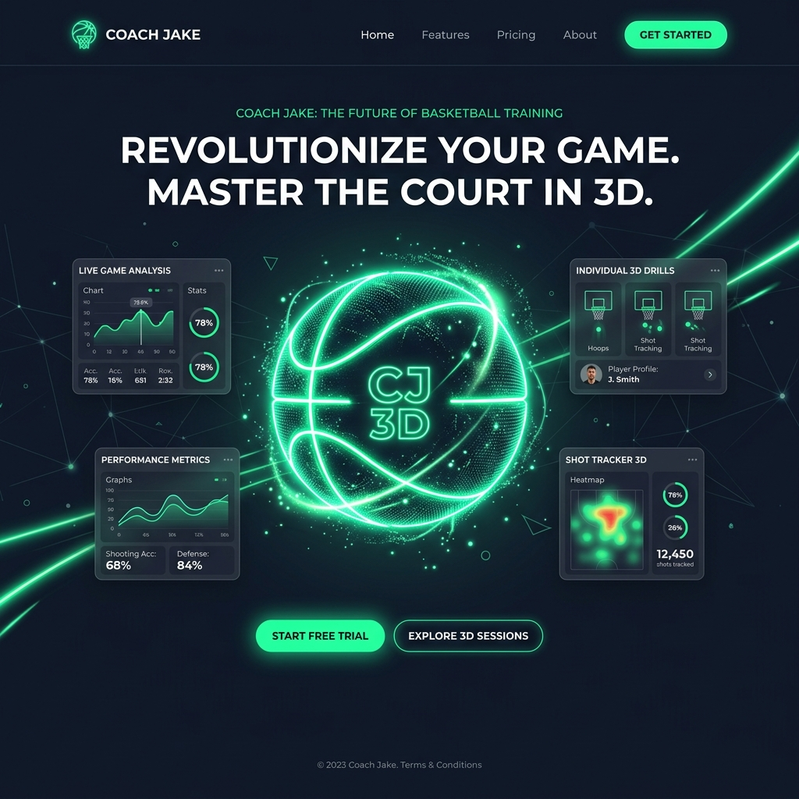
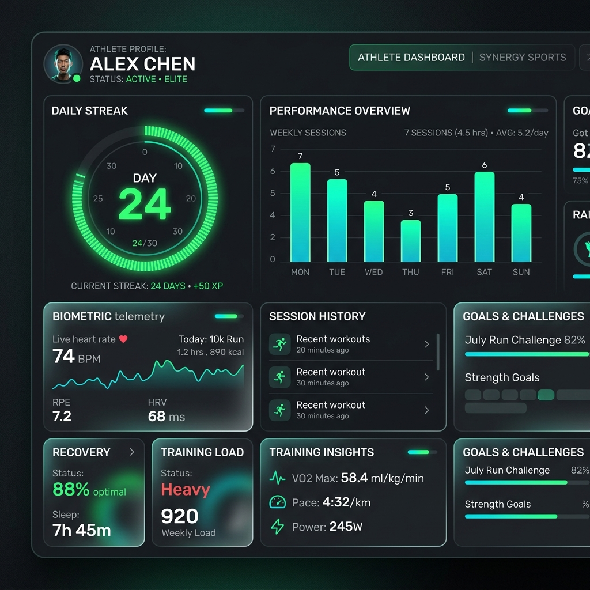
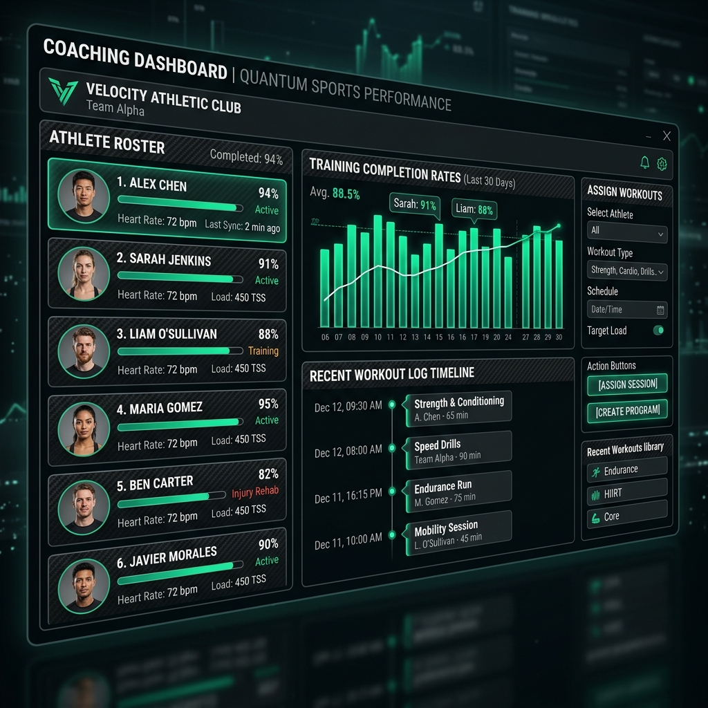
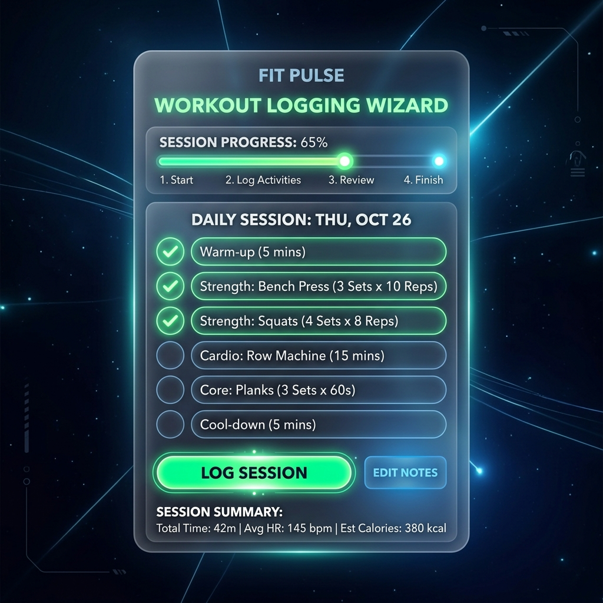
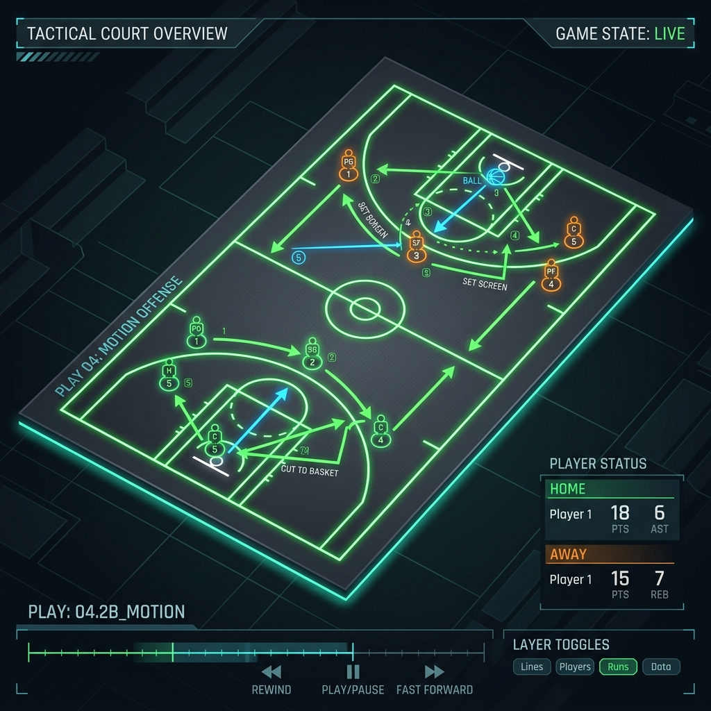
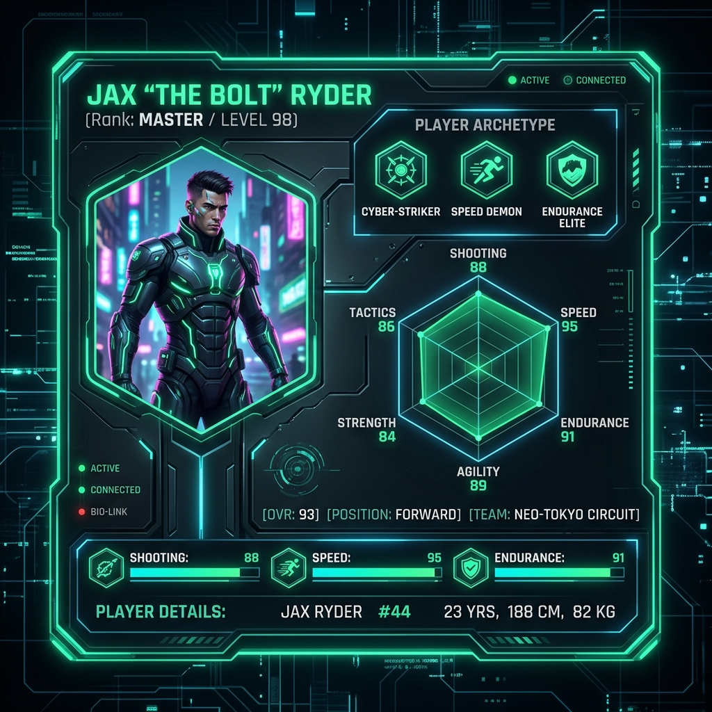

# 🏀 Coach Jake — Futuristic Basketball Performance & Telemetry Platform

> A role-based athletic telemetry and strength/conditioning platform built for serious basketball players and the coaches who build them.

[](https://github.com/Nitheesh0217/coach-jake-app/actions)
[](https://coach-jake-app.vercel.app)
[](https://opensource.org/licenses/MIT)

---

## 📸 Platform Showcase

### 1. Hero Landing Page


### 2. Athlete Telemetry Dashboard


### 3. Coach Roster Dashboard


### 4. Interactive Workout Logging


### 5. 3D Tactical Playbook Court


### 6. Interactive Player Card Profiler


---

## ⚡ Tech Stack

This platform is engineered using modern, high-performance web standards to deliver fluid 60fps animations, real-time data sync, and type safety:

- **Framework**: [Next.js 16+ (App Router)](https://nextjs.org/) using Server Actions & React Server Components
- **Language**: [TypeScript](https://www.typescriptlang.org/) (Strictly-typed interfaces, zero-any policy)
- **Database & Auth**: [Supabase (PostgreSQL)](https://supabase.com/) with Row Level Security (RLS) policies
- **3D Engine**: [Three.js](https://threejs.org/) via [React Three Fiber](https://docs.pmnd.rs/react-three-fiber/) & [Drei](https://github.com/pmnd.rs/drei)
- **Styling**: [Tailwind CSS](https://tailwindcss.com/) (Fluid HSL-derived colors, glassmorphism, responsive grid layouts)
- **Animations**: [Framer Motion](https://www.framer.com/motion/) (Micro-interactions, staggered fade transitions)
- **Data Visualization**: [Recharts](https://recharts.org/) (Interactive radar and line charts)
- **Icons**: [Lucide React](https://lucide.dev/)

---

## 🚀 Key Features

1. **3D Telemetry HUD**: A fully interactive, responsive 3D basketball orb and starfield rendered client-side utilizing React Three Fiber.
2. **Dual-Dashboard Portal**: Dedicated, role-based interfaces for coaches and athletes, protected with Next.js edge middleware.
3. **One-Tap Workout Logging**: Dynamic workout tracking wizard featuring interactive step check-offs, post-workout logs, and automatic streak calculations.
4. **Player Archetype System**: Custom profiling that analyzes team-vs-iso, shooter-vs-slasher, and finesse-vs-power metrics to output a specific player archetype.
5. **Interactive 3D Tactical Court**: A customizable 3D basketball playground for playbooks, drawing pathways, and player placements.
6. **Real-time Progress Charts**: Visualization of telemetry metrics like weight tracking over 30 days and player attribute radar charts.
7. **Streak & Volume Tracking**: Automatic calculations for current active streaks, longest active streaks, and weekly training volume.
8. **Role-Based Auth & RLS**: Fully secure onboarding and sign-up/login processes mapped to Supabase profiles with table level constraint checks.
9. **Responsive Mobile-First UI**: Dark-themed, futuristic cyberpunk cyber-HUD aesthetic optimized across desktop, tablet, and mobile browsers.

---

## 🏗️ Architecture & Core Systems

### 1. The 4-Layer Z-Index Stack
To achieve a premium, high-tech glassmorphic spatial depth, the platform uses a structured 4-layer rendering system:
*   **Layer 1 (Base, `z-index: -10`)**: Dynamic Canvas loading R3F 3D background elements (Basketball Orb, floating starfield, ambient light reflections).
*   **Layer 2 (Backdrop, `z-index: 0`)**: Fixed radial color-bleed overlays and CSS grid textures providing visual texture.
*   **Layer 3 (Glassmorphic Cards, `z-index: 10`)**: Semi-transparent UI panels configured with border-glows and backdrop blurs (`backdrop-blur-md`).
*   **Layer 4 (Modals & HUD Overlays, `z-index: 50+`)**: Interactive telemetry wizards, menus, and real-time toast alerts (`sonner`).

### 2. Database Schema (Supabase PostgreSQL)
*   `profiles`: Stores core athlete and coach metadata including height, weight, player archetype, playstyle vectors (team, shooter, finesse), and scouting status.
*   `workouts`: Stores training workout definitions (strength, skill, conditioning) and difficulties.
*   `workout_assignments`: Links specific workouts assigned by a coach to target athletes.
*   `workout_logs`: Records athlete session completion events, timestamps, and active comments.
*   `measurements`: Records chronological weight logs to compute metrics over time.

---

## 🛠️ Getting Started

### Prerequisites
- Node.js (v18.0.0 or higher)
- npm (v10.0.0 or higher)

### Installation

1. **Clone the Repository**
   ```bash
   git clone https://github.com/Nitheesh0217/coach-jake-app.git
   cd coach-jake-app
   ```

2. **Install Dependencies**
   ```bash
   npm install
   ```

3. **Configure Environment Variables**
   Create a `.env.local` file at the root of the project:
   ```env
   NEXT_PUBLIC_SUPABASE_URL=your_supabase_project_url
   NEXT_PUBLIC_SUPABASE_ANON_KEY=your_supabase_anon_api_key
   ```

4. **Initialize Supabase Schema**
   Run the migration SQL scripts located in the root of the directory:
   - Run `supabase-setup.sql` to initialize profiles, workouts, and logs.
   - Run `supabase-migrations-player-card.sql` to add custom player card fields.
   - Run `supabase-migrations-workout-assignments.sql` to link trainer assignments.

5. **Run the Development Server**
   ```bash
   npm run dev
   ```
   Open [http://localhost:3000](http://localhost:3000) to view the application.

---

## 🗂️ Environment Variables

| Variable | Description | Example Value |
| :--- | :--- | :--- |
| `NEXT_PUBLIC_SUPABASE_URL` | The API URL endpoint of your Supabase project | `https://your-project-id.supabase.co` |
| `NEXT_PUBLIC_SUPABASE_ANON_KEY` | The anonymous public API key for Supabase client queries | `eyJhbGciOiJIUzI1NiIsInR5cCI6IkpXVCJ9...` |

---

## 👨‍💻 Author

**Nitheesh Donepudi**  
*   *Credentials*: Master's in Data Science & Analytics (Graduate Research Assistant), Florida Atlantic University (2023-2025)
*   *Expertise*: Full-Stack Software Engineering, Sports Telemetry, UI Design
*   *Tech Focus*: Next.js, TypeScript, React, Supabase, Three.js, Data Visualization
*   *LinkedIn*: [Nitheesh Donepudi](https://www.linkedin.com/in/nitheesh-donepudi/)  
*   *Portfolio*: [GitHub Profile](https://github.com/Nitheesh0217)

---

## 📄 License

This project is licensed under the MIT License - see the [LICENSE](LICENSE) file for details.
